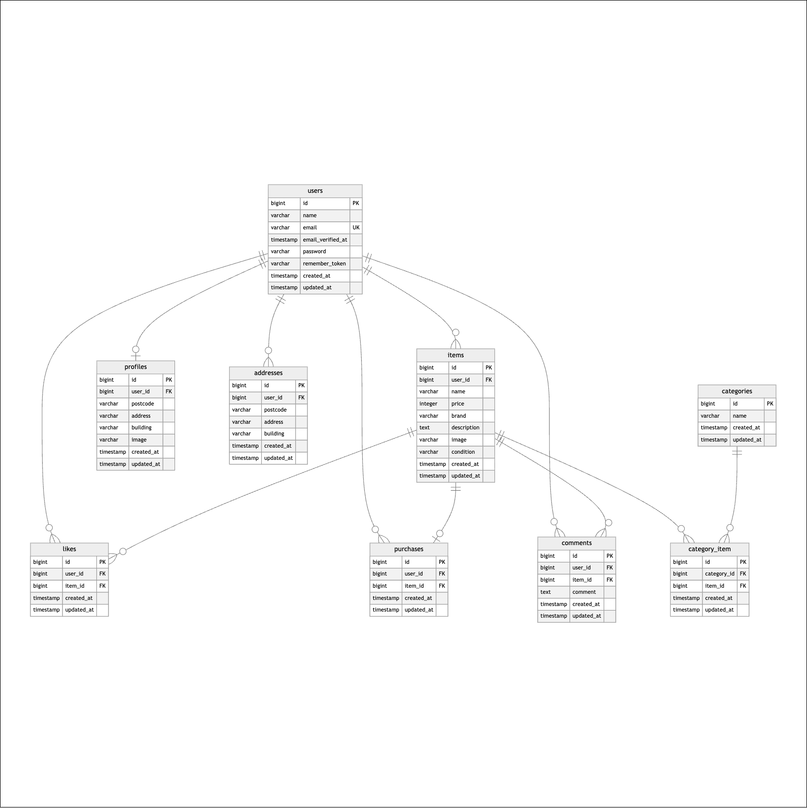

# flea-market-app

フリマアプリを模したWebアプリケーションです。

ユーザーは会員登録・ログイン後に商品を出品、購入、いいね、コメントすることができます。

## 主な機能

- 会員登録
- ログイン / ログアウト
- メール認証
- 商品一覧表示
- 商品検索
- 商品詳細表示
- 商品出品
- 商品購入
- いいね機能
- コメント機能
- プロフィール編集

## 環境構築

### Dockerビルド

```bash
git clone git@github.com:mayuniwata/flea-market-app.git
cd flea-market-app
docker-compose up -d --build
```

### Laravel環境構築

```bash
docker-compose exec php bash

composer install
cp .env.example .env
php artisan key:generate
```

### マイグレーション・シーディング

```bash
php artisan migrate:fresh --seed
```

## 使用技術

- PHP 8.1
- Laravel 8.x
- MySQL 8.0
- Nginx
- Docker
- Laravel Fortify
- PHPUnit
- MailHog

## テスト

```bash
php artisan test
```
全テスト成功確認済み


## メール認証

会員登録後、MailHogで認証メールを確認できます。

- MailHog：http://localhost:8025

## ログイン情報

管理者ユーザーは実装していません。

### 一般ユーザー

メールアドレス

```text
test@example.com
```

パスワード

```text
password
```

## URL

- 開発環境：http://localhost
- phpMyAdmin：http://localhost:8080
- MailHog：http://localhost:8025

## ER図



